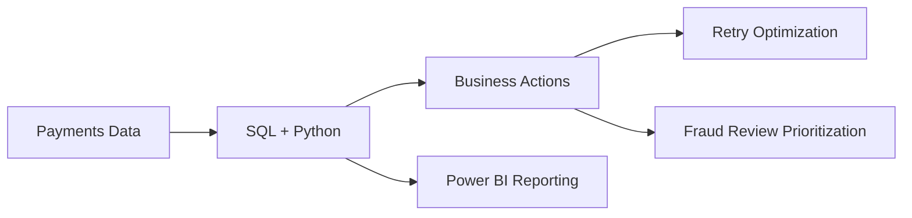

# Payments Optimization and Fraud Analytics

Portfolio-scale analytical work combining SQL, Python scoring, and Power BI to frame **payment success**, **retry recovery**, and **fraud review prioritization** on a representative dataset (not measured production uplift).

---

## Business questions this answers

1. **Where are we losing approvals?** Concentration of decline reasons and failed dollar volume.
2. **What share of failures can realistically be reworked?** Same-user success within 24 hours after failure (recovery signal).
3. **Which transactions merit fraud review next?** Holdout-evaluated supervised scores with batch inference for a ranked queue.
4. **How do stakeholders monitor trends?** CSV + SQL marts + optional Power BI overlays.

---

## Key metrics

| Concept | Anchored snapshot |
| --- | --- |
| Transactions analyzed | 51,237 |
| Failure rate | 12.92% |
| Failed value pool (opportunity framing) | $500,157.98 |
| Fail → success within 24h | 1,554 / 6,619 failed (~23.5%) |
| Fraud holdout (time split, threshold chosen on train) | See `outputs/train_metrics_report.csv` after `fintech.py train` |

See `outputs/README.md` for **canonical output filenames** and score column definitions (`fraud_probability` / `risk_score` / `anomaly_score`).

---

## Methodology (brief)

1. **SQL diagnostics** — auth rates, error mix, cohort and retry journeys against `payment_optimization.payments` (patterns captured in `sql quries/` and reporting-ready summaries in [`sql/marts/`](sql/marts/).).
2. **Feature engineering & modeling** (`fintech.py`) — velocity-aware features, stratified or time-based holdout, persisted artifact (`outputs/fraud_model.joblib`).
3. **Risk scoring semantics** — Supervised outputs use **`fraud_probability`** and mirrored **`risk_score`**. **Isolation Forest** keeps **`anomaly_score`** (raw `decision_function`) plus **`risk_score`** = negated raw so “higher = riskier” matches classifier direction.

---

## Tooling & scripts

| Script | Role |
| --- | --- |
| `fintech.py train \| infer` | Train/evaluate, write `fraud_scored_transactions.csv` or `daily_scored_transactions.csv` |
| `score_daily.py` | Thin wrapper calling inference with **`daily_scored_transactions.csv`** default |
| `benchmark_models.py` | Supervised benchmarks: **threshold on calibration split**, ROC/PR/confusion-derived metrics on held-out **test** |
| `run.ps1` | PowerShell shortcuts for train / infer / benchmark |
| [`fintech_dataset_generator.py`](fintech_dataset_generator.py) | **Placeholder only — not portfolio data**. |

---

## Repo map

- `sql quries/` — Original BigQuery study queries (historical spelling retained).
- `sql/marts/` — Curated selects for KPI, retry/recovery, and fraud-queue framing.
- `Tables/` — CSV snapshots exported from analyses.
- `outputs/` — Metrics, artifacts, predictions (see [`outputs/README.md`](outputs/README.md)).
- [`PROJECT_CONTEXT.md`](PROJECT_CONTEXT.md) — Problem framing & recommendations narrative.
- [`RESUME_BULLETS_VERIFIED.md`](RESUME_BULLETS_VERIFIED.md) — Canonical resume bullets for this repo.

---

## Limitations & dataset framing

- The bundle is **representative** of a portfolio-scale analytics exercise, not a live production control.
- Fraud labels in this demo have **high prevalence** relative to typical production fraud — interpret queue sizes and precision claims in that context.
- Value and recovery figures are **signals and scenarios**, not realized revenue unless measured after deployment.

---

## How to reproduce

1. **Environment:** `python -m venv .venv` → activate → `pip install -r requirements.txt`

2. **Train + holdout + artifact + scored table**

   `python fintech.py train --input fintech_fraud_data.csv --output outputs/fraud_scored_transactions.csv --model-out outputs/fraud_model.joblib --model-type hist_gradient_boosting --evaluation-mode time --test-size 0.25 --metrics-out outputs/train_metrics_report.csv`

3. **Daily-style scoring**

   `python score_daily.py --input fintech_fraud_data.csv --model outputs/fraud_model.joblib --output outputs/daily_scored_transactions.csv`

4. **Benchmarks (no threshold leakage on test)**

   `python benchmark_models.py --input fintech_fraud_data.csv --output outputs/model_benchmark_results.csv --topk-frac 0.05`

5. **Shortcuts:** `.\run.ps1 -Task train`, `.\run.ps1 -Task infer -InputPath <csv>`, `.\run.ps1 -Task benchmark`

---

## SQL workflow

Ad hoc study queries: `sql quries/` on `project-43c16c81-2fd4-4871-8ac.payment_optimization.payments` (and `dim_fees` after `Dim_Fees.sql`). Reporting marts: [`sql/marts/`](sql/marts/).

---

## Power BI (evidence layer)

Screenshots are user-provided under `powerbi-screenshots/` (`01-executive-summary.png`, `02-retry-and-failures.png`, `03-fraud-risk-monitoring.png`). See `powerbi-screenshots/README.md`.

---

## Architecture

High-level diagram: [`docs/ARCHITECTURE.md`](docs/ARCHITECTURE.md).

