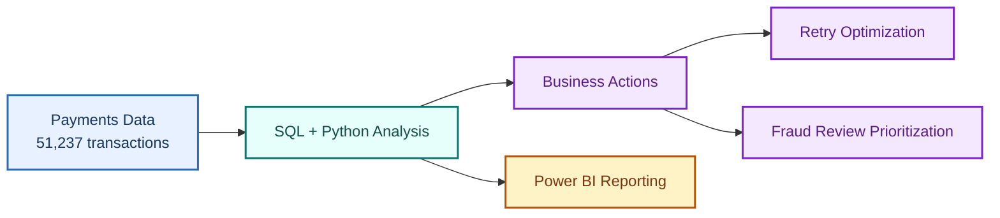
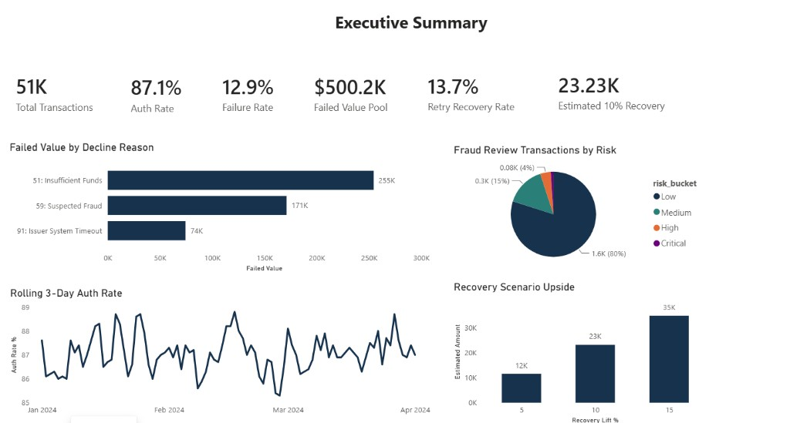
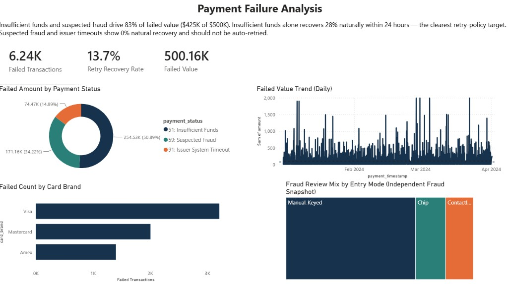
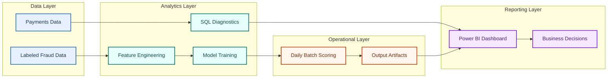
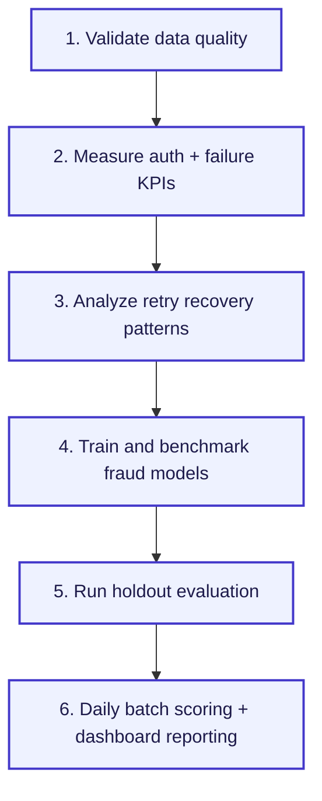

# Payments Optimization and Fraud Analytics

## 30-Second Overview

This project combines SQL and Python to solve a real fintech problem:
**improve payment success while controlling fraud risk**.

In one workflow, it:
- quantifies payment leakage and failed value,
- surfaces retry/recovery opportunities,
- scores fraud risk daily for prioritized review,
- and presents outcomes in Power BI for business decisions.

Key validated outputs include:
- `51,237` payments analyzed,
- `12.92%` failure rate with `$500K+` failed value opportunity pool,
- `23.5%` post-failure success signal within 24 hours,
- holdout fraud scoring results with `83.5%` recall at a selected threshold.

## Quick Visual Snapshot

| Metric | Value | Why it matters |
|---|---:|---|
| Transactions analyzed | 51,237 | Shows scale of analysis |
| Failure rate | 12.92% | Quantifies payment leakage |
| Failed value pool | $500,157.98 | Revenue opportunity estimate |
| Retry opportunity | 23.5% | Indicates recoverable failures |
| Holdout recall | 83.5% | Fraud capture on unseen sample |

## Project Objectives

- Find where payment failures are happening and how much value is getting stuck.
- Check how many failed payments later succeed (retry opportunity).
- Build a fraud risk model to rank suspicious transactions for manual review.
- Export results so teams can track daily performance and act quickly.

## Validated Metrics

- Payments analyzed: `51,237`
- Failed payments: `6,619` (`12.92%` fail rate)
- Failed transaction value opportunity pool: `$500,157.98`
- Failed payments that later succeeded within 24h: `1,554 / 6,619` (`23.5%`)
- Fraud holdout evaluation (time split, threshold-based operating point):
  - Recall: `83.5%`
  - Precision: `100.0%`
  - False positives: `0`
  - Notes: this is a threshold-specific holdout sample result on project data, not a universal production guarantee.

## Business Outcomes

- Quantifies money at risk in failed payments.
- Surfaces retry and routing opportunities to recover lost approvals.
- Prioritizes fraud review workload with risk ranking instead of random checks.
- Gives a repeatable daily scoring flow for monitoring.

## Key Recommendations

1. Retry only recoverable declines in high-success windows.
2. Prioritize top failure reasons first (largest volume impact).
3. Use risk-ranked queue for manual fraud review.
4. Track weekly KPIs: auth rate, fail value, retry recovery, review precision.

## Project Layout

- `fintech.py` - Train/infer pipeline with holdout evaluation and artifact saving
- `score_daily.py` - Simple daily scoring wrapper
- `benchmark_models.py` - Model comparison report (supervised baselines)
- `run.ps1` - One-command helper for train/infer/benchmark
- `fintech_payments(Main Table).csv` - Payments dataset
- `fintech_fraud_data.csv` - Labeled fraud dataset
- `sql quries/` - SQL analysis queries (BigQuery style)
- `Tables/` - Exported SQL result tables
- `outputs/` - Generated outputs (metrics, predictions, model artifact)
- `PROJECT_CONTEXT.md` - Business context and recommendation summary
- `RESUME_BULLETS_VERIFIED.md` - Validated resume bullet options

## Setup

1. Create and activate virtual environment:
   - `python -m venv .venv`
   - `.venv\Scripts\Activate.ps1`
2. Install dependencies:
   - `pip install -r requirements.txt`

## Core Commands

Train + holdout evaluation + saved model artifact:

- `python fintech.py train --input fintech_fraud_data.csv --output outputs/fraud_model_output.csv --model-out outputs/fraud_model.joblib --model-type hist_gradient_boosting --evaluation-mode time --test-size 0.25 --metrics-out outputs/train_metrics_report.csv`

Score new daily file:

- `python score_daily.py --input daily_transactions.csv --model outputs/fraud_model.joblib --output outputs/daily_fraud_predictions.csv`

Benchmark models for comparison:

- `python benchmark_models.py --input fintech_fraud_data.csv --output outputs/model_benchmark_results.csv --topk-frac 0.05`

Shortcut (PowerShell):

- `.\run.ps1 -Task train`
- `.\run.ps1 -Task infer -InputPath daily_transactions.csv`
- `.\run.ps1 -Task benchmark`

## SQL Workflow

Run query pack in `sql quries/` against:

- `project-43c16c81-2fd4-4871-8ac.payment_optimization.payments`
- `project-43c16c81-2fd4-4871-8ac.payment_optimization.dim_fees` (after `Dim_Fees.sql`)

Suggested order:

1. `Checking errors.sql` (quality check)
2. `Dim_Fees.sql` (fee reference table)
3. KPI and diagnostics queries (auth, retry, errors, cohort, segmentation, profitability)

## Power BI Dashboard Evidence

This project includes a Power BI reporting layer to make outcomes visible to non-technical stakeholders.

Add screenshots in `powerbi-screenshots/` with these names:

- `01-executive-summary.png`
- `02-retry-and-failures.png`
- `03-fraud-risk-monitoring.png`

GitHub visual preview (auto-renders once screenshots are added):

### Dashboard Insights

- **Executive view:** shows payment volume, fail rate, failed value opportunity pool, and trend snapshot.
- **Retry and failures:** highlights top failure reasons and the 24h retry-success signal (`23.5%`) to guide recovery strategy.
- **Fraud monitoring:** shows risk-ranked queue behavior and daily flagged volume for analyst prioritization.

## Architecture

- Detailed diagram: `docs/ARCHITECTURE.md`
- Quick view:

## Project Workflow

## Notes

- `sql quries/` keeps the original folder naming used in this project.
- Claims should use words like "identified", "quantified", "estimated", and "opportunity pool" unless measured business rollout results exist.
