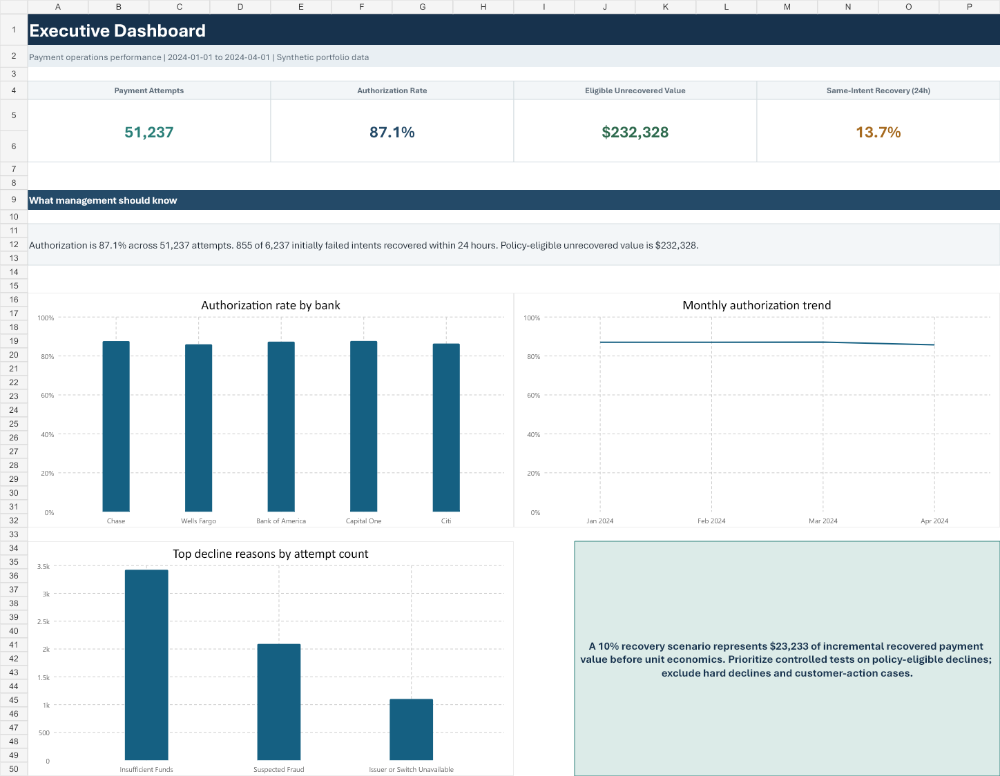
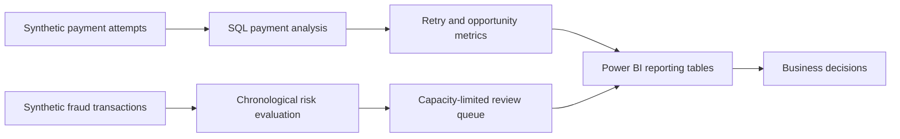

# Payments Optimization and Fraud Analytics

**The problem.** When a card payment is declined, the business loses the sale even though many declines are recoverable — a customer with insufficient funds today may succeed tomorrow, while a hard decline like suspected fraud should never be retried. Most teams see a single "failure rate" number and can't tell which failures are worth acting on. Meanwhile, fraud teams have limited review capacity and need to know *which* transactions to look at first.

**What this analysis does.** Using a synthetic three-month payment snapshot (51,237 attempts), this project breaks the 12.92% failure rate into decline reasons, quantifies which failures actually recover through retries, sizes the recoverable value pool by retry policy, and designs a capacity-limited fraud review queue that concentrates fraud ~1.7× over random review.

**What it found.**

- **85% of failed value comes from just two decline reasons** — insufficient funds ($255K) and suspected fraud ($171K) — so retry policy only needs to get a few codes right.
- **Only insufficient-funds declines recover naturally** (28.1% within 24 hours); suspected fraud and issuer timeouts show 0% recovery and should not be auto-retried.
- **$232K of unrecovered failed value is policy-eligible for retries**; a conservative 10% recovery scenario is worth ~$23K on this snapshot.
- **A top-10% fraud review queue reaches 9.5% precision vs. a 5.5% baseline**, letting a fixed-capacity review team catch more fraud without extra headcount.

All data is synthetic and results demonstrate analytical method and decision framing, not production bank outcomes. Full numbers are in [Headline results](#headline-results) below; recommendations and guardrails are in the [executive summary](docs/EXECUTIVE_SUMMARY.md).

## Portfolio deliverables

| Deliverable | What it demonstrates |
| --- | --- |
| [Excel analysis workbook](deliverables/Payments_Optimization_Excel_Analysis.xlsx) | Data cleaning, quality checks, formulas, lookups, pivot-style analysis, charts, scenario modeling, sensitivity analysis, and VBA workflow design |
| [Power BI dashboard](Payments_Optimization_Dashboard.pbix) | Executive KPI reporting, payment-failure analysis, retry opportunity reporting, and fraud-review monitoring inputs |
| [Executive summary](docs/EXECUTIVE_SUMMARY.md) | Business findings, recommended actions, and experiment guardrails |
| [SQL analysis](sql/analysis/) and [reporting marts](sql/marts/) | Exploratory analysis, reusable KPI logic, and reporting-ready transformations |
| [Python pipeline](run.ps1) | Reproducible retry scenarios, chronological fraud evaluation, scoring, and Power BI data contracts |


*Power BI Executive Summary page*


*Excel executive dashboard*

## Business questions

1. Where are payment approvals being lost?
2. Which decline reasons and issuer segments create the largest failed-value pools?
3. Which failed payment intents later succeed through a linked retry?
4. Which transactions should enter a capacity-limited fraud review queue?

## Headline results

| Business metric | Current result | Interpretation |
| --- | ---: | --- |
| Payment attempts analyzed | 51,237 | Three-month synthetic payment snapshot |
| Authorization failure rate | 12.92% | 6,619 failed attempts |
| Failed payment value | $500,157.98 | Opportunity pool, not realized loss |
| Same-intent recovery within 24 hours | 855 / 6,237 (13.71%) | Share of initially failed intents (excluding retry rows themselves) recovered by a linked `-RETRY` attempt |
| Policy-eligible unrecovered value | $232,327.98 | Excludes decline codes that should not be automatically retried |
| Illustrative 10% recovery scenario | $23,232.80 | Scenario estimate, not realized revenue |

Supporting fraud-review workflow (capacity-limited queue design, not a production model):

| Workflow metric | Current result | Interpretation |
| --- | ---: | --- |
| Fraud review queue | Top 200 of 2,000 test rows | Fixed 10% review capacity |
| Fraud queue precision | 9.5% vs. 5.5% baseline | Approximately 1.7× concentration in the review queue |
| Fraud ranking ROC-AUC | 0.621 | Moderate synthetic test signal; not production performance |

## Power BI dashboard

The Power BI report is [`Payments_Optimization_Dashboard.pbix`](Payments_Optimization_Dashboard.pbix). It contains:

- Executive Summary
- Payment Failure Analysis
- Fraud Risk Monitoring (KPI cards, risk-bucket breakdown, feature importance, and a Key Drivers visual)

See [`docs/POWER_BI.md`](docs/POWER_BI.md) for the full page-by-page guide, data model, DAX measures, and refresh workflow.

Power BI reads only from [`powerbi-data/`](powerbi-data/) — stable CSV contracts regenerated by the Python pipeline. Page previews live in [`powerbi-screenshots/`](powerbi-screenshots/).

## Analytics workflow



### Payment analysis

- SQL measures authorization performance, decline concentration, issuer patterns, and failed value.
- Retry recovery is matched through payment-intent lineage (`TXN-123` → `TXN-123-RETRY`).
- The decline-code dimension prevents hard declines such as suspected fraud from being counted as routine retry opportunities.

### Fraud review analysis

- Fraud prevalence is 5.19%, with fraud and legitimate transactions present in every entry mode and merchant category.
- Evaluation uses a chronological 60% train / 20% calibration / 20% test design.
- Power BI receives 2,000 test-period rows that were not used for model training or threshold calibration.
- `risk_flag` selects the top 10% of each scored batch to represent a fixed manual-review capacity.

The fraud component is intentionally small. This is an analytics project with a supporting ranking workflow—not an advanced machine-learning project.

## Data organization

| Folder | Purpose |
| --- | --- |
| `data/raw/` | Original synthetic payment snapshot and archived fraud seed |
| `data/processed/` | Active fraud training dataset and generation report |
| `data/reference/` | Decline-code definitions and retry policy |
| `data/sql_exports/` | Checked-in outputs from the SQL analysis layer |
| `outputs/` | Reproducible analytical and scoring outputs |
| `powerbi-data/` | Stable, dashboard-compatible CSV contracts |
| `deliverables/` | Recruiter-facing Excel and reporting artifacts |

Payments and fraud are independent synthetic snapshots. They do not share a verified transaction or customer identity key and are intentionally not joined.

See [`data/DATA_CARD.md`](data/DATA_CARD.md) and [`docs/DATA_DICTIONARY.md`](docs/DATA_DICTIONARY.md) for definitions and limitations.

## Quick start

### 1. Create the environment

```powershell
python -m venv .venv
.\.venv\Scripts\Activate.ps1
pip install -r requirements.txt
```

### 2. Rebuild the complete analysis

```powershell
.\run.ps1 -Task all
```

Individual tasks are also available:

```powershell
.\run.ps1 -Task train
.\run.ps1 -Task infer
.\run.ps1 -Task scenario
.\run.ps1 -Task powerbi
```

### 3. Refresh Power BI

Open `Payments_Optimization_Dashboard.pbix`, select **Home → Refresh**, and verify:

- 51,237 payment attempts
- 12.92% payment failure rate
- 13.71% same-intent recovery
- 2,000 fraud test rows with 200 review flags

## Repository map

| Path | Purpose |
| --- | --- |
| `sql/analysis/` | Exploratory BigQuery SQL |
| `sql/marts/` | Reporting-ready SQL marts |
| `scenario_simulator.py` | Same-intent retry and opportunity scenarios |
| `fintech.py` | Small fraud-risk training and scoring workflow |
| `prepare_powerbi_tables.py` | Stable Power BI export contracts |
| `deliverables/Payments_Optimization_Excel_Analysis.xlsx` | Recruiter-facing Excel analysis and scenario model |
| `Payments_Optimization_Dashboard.pbix` | Power BI report deliverable |
| `tests/` | Data, methodology, and schema regression tests |
| `docs/EXECUTIVE_SUMMARY.md` | Stakeholder-oriented result summary |
| `docs/RESUME_BULLETS_VERIFIED.md` | Claims tied to current outputs |

## Limitations

- All transaction data is synthetic and enriched for analytical demonstration.
- Opportunity amounts are scenarios, not measured revenue gains.
- Fraud labels are modeled assumptions, not bank-confirmed outcomes.
- Model performance is intentionally modest and should not be compared with production fraud systems.
- A controlled experiment would be required before claiming approval-rate or recovery uplift.
