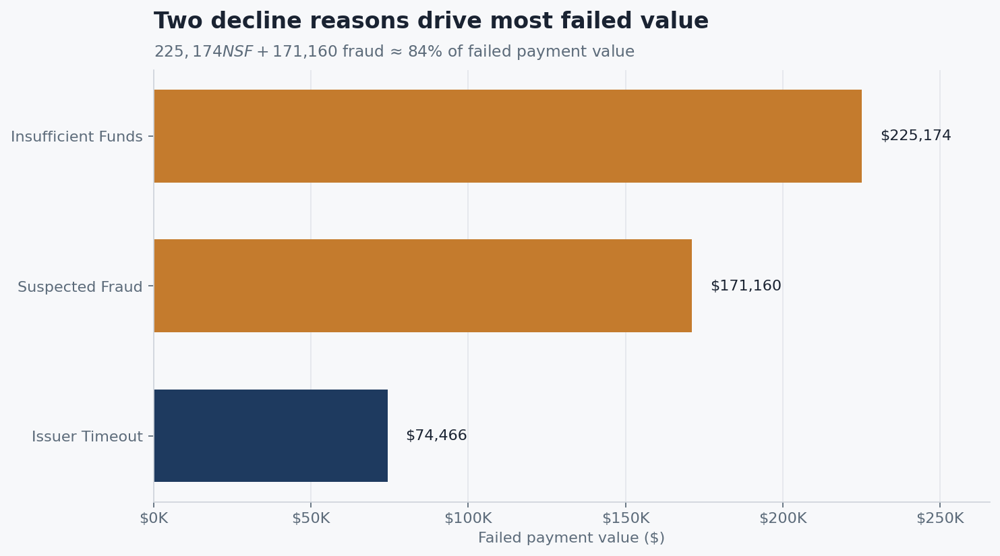
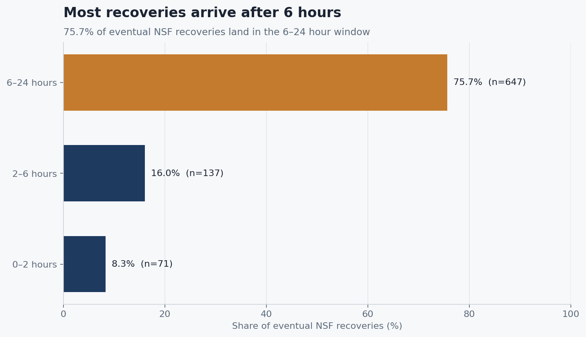
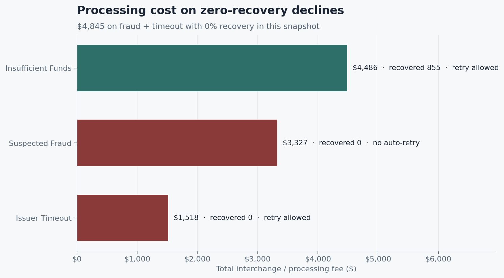
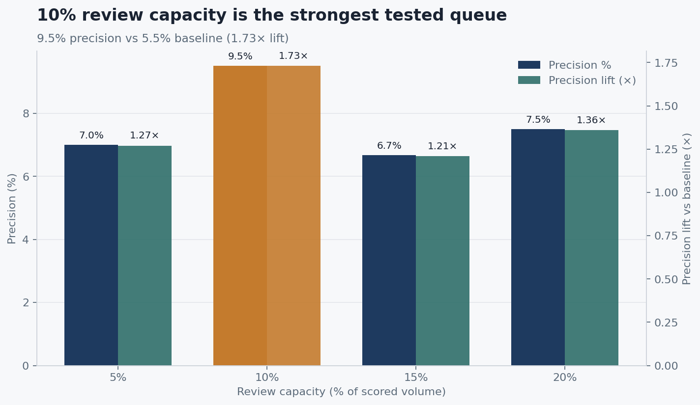
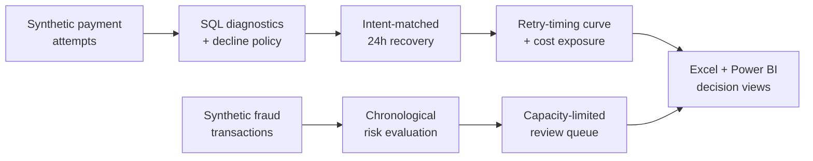

# Payment Recovery and Operations Analytics


**When a card payment fails, which declines are worth retrying — and how long should you wait?**

Most teams see one failure-rate number. That hides the real operating problem: some declines recover on a predictable schedule, others never should be retried, and fraud review capacity is finite. This project turns a **synthetic 51,237-attempt** payment snapshot into a decision view — decline triage, a minutes-to-recovery curve, processing-cost exposure, and a capacity-limited fraud review queue.

*Synthetic portfolio data for method demonstration. Dollar figures are opportunity pools and scenario estimates, not claimed production savings.*

### What you get

| Deliverable | In plain terms |
|---|---|
| **Retry timing curve** | When NSF recoveries actually land (not just whether they recover) |
| **Payment action matrix** | Decline-level policy, recovery evidence, and recommended ops action |
| **Excel analysis workbook** | Executive dashboard, quality checks, pivots, and scenario model |
| **Power BI report** | Failure analysis, retry opportunity, and fraud-review monitoring |
| **Fraud review queue** | Fixed-capacity ranking so reviewers see the densest fraud first |

**Excel workbook — Executive dashboard**


**In short:** **12.92%** of attempts fail · **~84%** of failed value sits in NSF + fraud · **75.7%** of NSF recoveries arrive after **6 hours** · **$232K** policy-eligible unrecovered pool · **~$23K** at a conservative 10% scenario · fraud queue **9.5%** precision vs **5.5%** baseline (**1.73×**)

---

## The problem

Failed payments look like a single “authorization rate” problem. Operationally they are three different problems:

1. **Which decline codes are recoverable?** Soft declines (insufficient funds) behave differently from hard declines (suspected fraud).
2. **When should a retry fire?** A recovery *rate* does not tell orchestration when to wait; a recovery *curve* does.
3. **Where should limited fraud review capacity go?** Scoring only helps if the queue design matches headcount.

This work answers those questions with lineage-matched retries (`TXN-123` → `TXN-123-RETRY`), decline-policy joins, and a chronological fraud evaluation split.

## Key findings

**1. Two decline reasons drive most of the money at risk.**  
Insufficient funds (**$225K**) and suspected fraud (**$171K**) account for about **84%** of failed payment value. Retry policy only needs to get a few codes right.

*Chart: Failed payment value by decline reason*



**2. Recovery is a timing problem, not only a yes/no.**  
**28.1%** of NSF declines recover within 24 hours, but only **8.3%** of those eventual recoveries land in the first 2 hours — **75.7%** show up in the **6–24 hour** window. Early retries fail predictably for most recoverable volume.

*Chart: Share of eventual NSF recoveries by time since decline*



**3. Hard declines burn processing cost with zero return.**  
Suspected fraud and issuer timeout show **0%** observed recovery. Together they carry **$4,845** in interchange-style processing cost on this snapshot. Fraud is correctly blocked from auto-retry (**$3,327** avoided). Issuer timeout is still marked retry-eligible in policy despite **0 / 1,102** recoveries — a policy-vs-data flag to test, not a settled ban.

*Chart: Processing cost by decline reason*



**4. A conservative recovery scenario is material — and measurable.**  
**$232,328** of unrecovered value sits on policy-eligible codes. A **10%** incremental recovery scenario sizes to **~$23,233** on this snapshot. That figure is a test design input, not revenue already booked.

**5. A 10% fraud review queue concentrates risk without extra headcount.**  
On chronological holdout scoring, a top-**10%** queue reaches **9.5%** precision versus a **5.5%** baseline (**1.73×** lift). Among 5% / 10% / 15% / 20% capacities tested, **10%** is the strongest operating point.

*Chart: Precision and lift by review capacity*



## Recommendations

Modeled operating changes sized from the data — not money already saved. Each row is something payments or fraud ops could pilot.

| Priority | What to do | Evidence | What it is worth (modeled) |
|---|---|---|---|
| **1** | Set a **minimum 6-hour retry delay** on insufficient funds; prioritize high-recovery bank/brand paths (e.g. BoA / Capital One Visa >30% observed) | **75.7%** of eventual NSF recoveries land in 6–24h; only **8.3%** in 0–2h | Focuses orchestration on the window where recovery is knowable; tops NSF unrecovered segments start at **$26K+** |
| **2** | Keep suspected fraud and customer-action codes out of auto-retry; route to verification | **0%** recovery on fraud; **$3,327** processing cost with no return if retried | Stops false recovery attempts and compliance/chargeback exposure |
| **3** | Re-test issuer timeout `automatic_retry_allowed = true` before the next config release | **0 / 1,102** recoveries; **$1,518** processing cost; **17.7%** of failures | Clears a policy-vs-data mismatch before more spend on dead retries |
| **4** | Hold fraud review at capacity-limited **top 10%** of daily scored volume | **9.5%** precision vs **5.5%** baseline (**1.73×**); weaker precision at 15–20% | More fraud per reviewer hour without growing the queue |

Portfolio-wide scenario at 10% lift on the eligible pool: **~$23K** incremental recovery on this snapshot — validate with a 4–6 week A/B (delayed vs immediate retry) before treating it as realized uplift.

## How it was built



| Step | What it does for the business |
|---|---|
| **1. Diagnose failures** | Auth rate, decline concentration, and issuer patterns — where approvals are lost |
| **2. Match recoveries** | Same-intent lineage links declines to successful `-RETRY` attempts within 24 hours |
| **3. Time the curve** | Minutes-to-recovery buckets plus interchange-style cost-of-attempt by decline reason |
| **4. Decide the action** | Action matrix joins evidence to policy: retry later, block, backoff, or investigate |
| **5. Rank the fraud queue** | Chronological train/calibration/test split; top 10% flagged for fixed review capacity |
| **6. Package for ops** | Excel and Power BI read the same `powerbi-data/` contracts as the analysis layer |

**Open and explore:**

| File | What you’ll see |
|---|---|
| [`deliverables/Payments_Optimization_Excel_Analysis.xlsx`](deliverables/Payments_Optimization_Excel_Analysis.xlsx) | Executive dashboard, cleaning, pivots, scenarios |
| [`Payments_Optimization_Dashboard.pbix`](Payments_Optimization_Dashboard.pbix) | Interactive Power BI report |
| [`powerbi-data/payment_action_matrix.csv`](powerbi-data/payment_action_matrix.csv) | Decline-level actions with recovery evidence |
| [`docs/EXECUTIVE_SUMMARY.md`](docs/EXECUTIVE_SUMMARY.md) | Stakeholder findings, priorities, and experiment guardrails |

**Power BI — Executive summary**


**Power BI — Retry and failures**


## Headline results

| Business metric | Result | Interpretation |
| --- | ---: | --- |
| Payment attempts | 51,237 | Three-month synthetic snapshot |
| Authorization failure rate | 12.92% | 6,619 failed attempts |
| Failed payment value | $500,158 | Opportunity pool, not realized loss |
| Same-intent recovery (24h) | 855 / 6,237 (**13.71%**) | Linked `-RETRY` successes on initially failed intents |
| Policy-eligible unrecovered value | **$232,328** | Excludes codes that should not auto-retry |
| Illustrative 10% recovery scenario | **$23,233** | Scenario estimate, not booked revenue |
| Fraud review @ 10% capacity | **9.5%** precision vs **5.5%** baseline | **1.73×** concentration in the queue |

## Tools and stack

| Layer | Tools |
|---|---|
| Analysis & modeling | Python (pandas, scikit-learn), BigQuery-oriented SQL |
| Decision packaging | Excel workbook, Power BI dashboard |
| Reproducibility | `run.ps1` pipeline, pytest contracts on schemas and methodology |

```powershell
python -m venv .venv
.\.venv\Scripts\Activate.ps1
pip install -r requirements.txt
.\run.ps1 -Task all
python generate_readme_assets.py
```

Refresh `Payments_Optimization_Dashboard.pbix` (**Home → Refresh**) after regenerating `powerbi-data/`.

## What's in this repo

| Path | Purpose |
|---|---|
| `sql/analysis/`, `sql/marts/` | Exploratory SQL and reporting marts |
| `scenario_simulator.py` | Same-intent recovery and opportunity scenarios |
| `retry_timing_analysis.py` | Minutes-to-recovery curve and cost-of-attempt |
| `fintech.py`, `score_daily.py` | Fraud ranking train / daily score |
| `prepare_powerbi_tables.py` | Stable Power BI CSV contracts |
| `generate_readme_assets.py` | README key visuals from checked-in outputs |
| `outputs/`, `powerbi-data/` | Analytical outputs and dashboard feeds |
| `tests/` | Data, methodology, and schema regression tests |

## Limitations

- All transaction data is **synthetic**; results demonstrate method and decision framing, not production bank outcomes.
- Scenario dollars are **opportunity sizing**, not measured revenue lift — validate with a controlled retry experiment before claiming uplift.
- Fraud labels and model metrics are **workflow demonstration** (ROC-AUC 0.621 on this set), not production fraud-system performance.
- `Interchange_Fee` is a synthetic per-attempt processing-cost field, not literal card-network interchange.
- The issuer-timeout policy mismatch is a **single-snapshot** observation (1,102 attempts, 0 recoveries) — treat as a hypothesis to re-test on a longer window.
