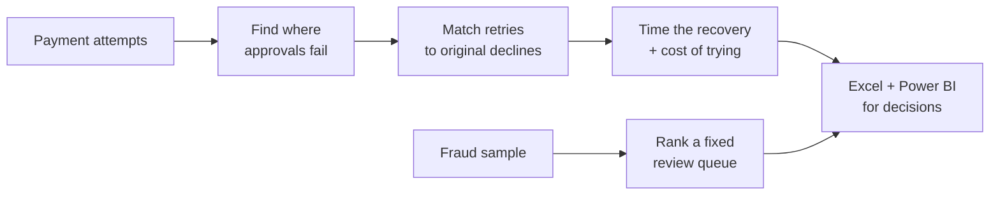

# Payment Recovery and Operations Analytics


**When a payment fails, should we retry it — and how long should we wait?**

A single “failure rate” hides three different decisions: which declines are worth another try, when that try should fire, and which fraud cases a limited review team should see first. This analysis turns a **synthetic 51,237-payment** snapshot into those decisions — sized in dollars, timing, and review capacity.

*Synthetic data for method demonstration. Dollar figures are opportunity sizes and scenarios, not claimed production savings.*

**In short:** **12.9%** fail · **~$500K** failed value · **~84%** of that sits in insufficient funds + fraud · **3 in 4** NSF recoveries land after **6 hours** · **$232K** still eligible to recover · **~$23K** at a conservative 10% scenario · fraud queue finds fraud **1.7×** better than random review

---

## Dashboard snapshot

Stakeholder view of the same numbers — authorization health, where failures concentrate, and what is still recoverable.


| Open this | What you’ll see |
|---|---|
| [`Payments_Optimization_Dashboard.pbix`](Payments_Optimization_Dashboard.pbix) | Interactive Power BI report |
| [`deliverables/Payments_Optimization_Excel_Analysis.xlsx`](deliverables/Payments_Optimization_Excel_Analysis.xlsx) | Executive dashboard, pivots, and scenario model |
| [`docs/EXECUTIVE_SUMMARY.md`](docs/EXECUTIVE_SUMMARY.md) | Full findings, priorities, and test guardrails |

---

## The problem

Failed payments look like one metric. Day to day they are three operating questions:

1. **Which declines come back?** Insufficient funds often recovers; suspected fraud almost never should be auto-retried.
2. **When should we retry?** Knowing *that* something recovers is not enough — operations need to know *when*.
3. **Where should scarce fraud review go?** Teams cannot review everything; they need the densest queue first.

Without that split, teams either retry too aggressively (wasted cost, customer friction) or leave recoverable revenue on the table.

---

## What the data shows

**Most of the money at risk sits in two places.**  
Insufficient funds (**$225K**) and suspected fraud (**$171K**) make up about **84%** of failed payment value. Get those two policies right and the rest of the portfolio moves with them.

**Recovery is late, not early.**  
**28%** of insufficient-funds declines recover within 24 hours — but **76%** of those recoveries do not show up until the **6–24 hour** window. Only **8%** land in the first two hours. A retry that fires immediately is usually asking before the outcome is knowable.


**Some declines should never be auto-retried.**  
Suspected fraud and issuer timeout show **0%** recovery here. Together they carry **~$4,800** in processing cost with no return. Fraud is already blocked from auto-retry; issuer timeout is still marked “retry allowed” in policy despite **0 of 1,102** recoveries — a config flag to re-test.

**The recoverable pool is still large.**  
After excluding codes that should not auto-retry, **$232K** remains policy-eligible. A conservative **10%** lift on that pool is about **$23K** on this snapshot — a sized pilot, not booked revenue.

**Fraud review works best as a short, ranked queue.**  
Reviewing the top **10%** of scored volume reaches **9.5%** precision versus a **5.5%** baseline (**1.7×** denser fraud). Wider queues (15–20%) dilute the hit rate.

---

## What to do next

These are **pilots sized from the data** — not money already saved.

| # | Recommendation | Why it holds | Sized impact |
|---|---|---|---|
| **1** | Wait **at least 6 hours** before retrying insufficient funds; prioritize bank/brand paths that already recover above ~30% | **76%** of NSF recoveries arrive after hour 6; early retries mostly fail on schedule | Puts orchestration on the window that works; top unrecovered NSF segments start at **$26K+** |
| **2** | Never auto-retry suspected fraud — send those to verification | **0%** recovery; **~$3.3K** processing cost with no return if retried | Cuts wasted retries and chargeback / compliance risk |
| **3** | Re-test the “retry allowed” flag on issuer timeouts before the next release | **0 / 1,102** recoveries; **~$1.5K** processing cost; **~18%** of failures | Stops spending on a decline type that behaves like a hard decline here |
| **4** | Keep fraud review at the **top 10%** of daily scored volume | Strongest tested capacity: **9.5%** precision, **1.7×** vs baseline | More fraud caught per reviewer hour without growing the queue |

**Bottom line for a pilot:** a controlled 4–6 week test of delayed vs immediate NSF retry is the path from the **~$23K** scenario to a measured result.

---

## How it was built



| Step | Business outcome |
|---|---|
| Diagnose declines | See which failure reasons and issuers drive lost approvals |
| Match same-payment retries | Measure true 24-hour recovery — not a generic second attempt |
| Time the curve | Decide *when* to retry, not only *whether* |
| Apply decline policy | Separate “retry later” from “block / verify / investigate” |
| Rank fraud review | Fill limited analyst capacity with the densest cases first |
| Package for stakeholders | Excel and Power BI read the same trusted tables |

**Tools:** SQL · Python · Excel · Power BI

<details>
<summary><strong>Rebuild the analysis</strong></summary>

```powershell
python -m venv .venv
.\.venv\Scripts\Activate.ps1
pip install -r requirements.txt
.\run.ps1 -Task all
```

Then open the `.pbix` and refresh. Full method notes: [`docs/EXECUTIVE_SUMMARY.md`](docs/EXECUTIVE_SUMMARY.md).

</details>

---

## Good to know

- Data is **synthetic** — this shows the decision method, not a live bank result.
- Dollar figures are **opportunity sizes and scenarios**, not measured revenue lift.
- Fraud scores sort a review queue; they are not a production fraud engine claim.
- The issuer-timeout finding is from **this snapshot** — re-check on a longer window before changing policy permanently.
