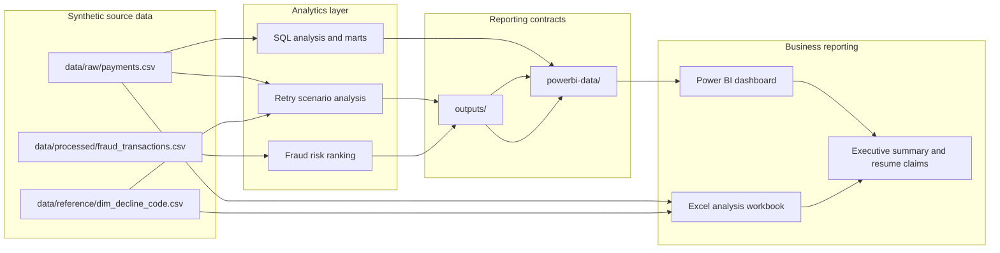

# Project Architecture

## Design goal

Keep raw synthetic evidence, analytical transformations, and dashboard contracts separate. Power BI consumes only stable files under `powerbi-data/`; analytical code can change without forcing dashboard redesigns.

## Key decisions

1. **No payment/fraud row-level join.** The independent datasets do not share verified transaction or customer keys.
2. **Same-intent retry matching.** Recovery requires the `-RETRY` lineage rather than any later user success.
3. **Stable Power BI contracts.** Required column names and ordering are protected by regression tests.
4. **Chronological fraud evaluation.** Training, calibration, and test rows are separated by time.
5. **Capacity-limited review queue.** Risk flags select the top 10% of a scored batch.
6. **Canonical retry metrics.** Same-intent 24-hour recovery and policy-eligible unrecovered value come from `outputs/recovery_scenarios.csv` across every reporting surface.

## Operational flow

1. SQL exports are stored in `data/sql_exports/`.
2. `scenario_simulator.py` rebuilds retry and opportunity outputs.
3. `fintech.py` rebuilds fraud metrics and scored queues.
4. `prepare_powerbi_tables.py` standardizes all dashboard CSVs.
5. Power BI refreshes from `powerbi-data/`.
6. The recruiter-facing Excel workbook is published under `deliverables/` and uses the same canonical retry outputs.
